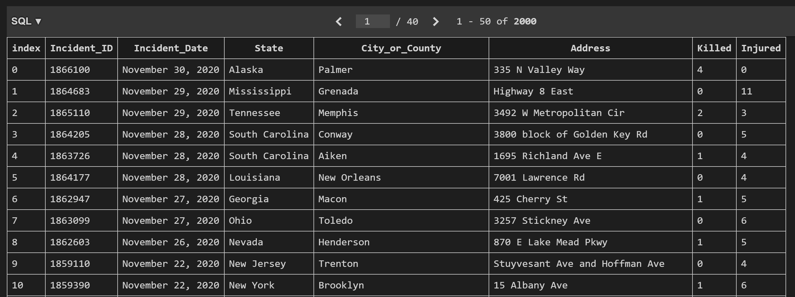

# SI507 Project Document
Siyuan He (hesy)

## Project code
Code Repo Url: https://github.com/sweetsinpackets/si507_project

The [readme](https://github.com/sweetsinpackets/si507_project/blob/master/readme.md) is at the root directory of the code base, here is meaningless to copy it here.

## Data Source
1. **Main Page**, [GVA Reports](https://www.gunviolencearchive.org/reports), HTML format
The page contains a list of href to subpages. The program will first crawl the basic page and list all the available reports for user to choose.
The function is `data_fetch.crawl_main_page`, returns a `dict` of `{page name: page link}`.
2. **Sub-report pages**, all pages listed in basic page, HTML format
For example, the biggest subpage [massive shooting reports](https://www.gunviolencearchive.org/mass-shooting) contains 2000 records, while other subpages have less records (still several hundred). We will retrieve all records on-demand, so the requesting time will be quite long (1 minute).
These pages will be crawled **on-demand** by user selection. Note that each subpage contains a sequence of pages, we will recursively crawl and combine all these sequential pages. 
The function is `data.fetch.multiple_scrape`, return a dataframe of all these records.
*Side Note:* The retrieved records are originally organized as `class_definition.shooting_record`, you can directly check the class definition. However, since we have 2000 records, and it will take 2 minutes to execute the request and instance generating, so I turned to use pandas dataframe because it's faster to use `.apply` function. The organization is similar to the class (just as the class initialization by a list), please refer to `class_definition.transfer`.
3. **MapQuest API request**
We use [MapQuest](https://www.mapquest.com/) API to search for the lat and lng by the address. 
4. Cache: all the requests are cached.
Note that since the website will update, so we refresh our cache every month. The API request cache won't update because they're stable.

## Database
All records of a selected report will be saved to a library. For example, the screenshot is a table of massive shooting record in 2020.

The fields of the table is corresponding to the fields of the reports on GVA. Except for `Incident_ID, Killed, Injured` which are integer, other fields are stored as string.
No foreign keys among the tables. It's because each report contains a different set of records, so each table is parallel to other tables. We don't need to connect them.
*Side Note:* In the program we need all these structures, so I used `pandas` to organize the records. For convenience, the database is created and loaded by the build-in functions of dataframe and sqlite3.

## Interaction and Presentation Plans
We provide both command line interaction and a map plot for presentation. The users will see a list of record information printed (surely human-friendly) in the command line interface as text output. Meanwhile, user can require a map plot to clearly see the distribution of the records on map. When executing the program, user will select the records they want by typing commands in the command line interface.
1. **Command Line Prompt**:
It's designed as every common command line interface program. It will ask the user to input command and check the user's input. The records will be displayed as a list of human readable string. If there are more than 10 records, we only show the top 10 records.
2. **Map Plot**:
We offer a map plot with dots representing shooting cases on the US map. The plot is implemented by `Plotly`, while the lat and lng are accessed from `MapQuest`. The plot is optional and only generated on-demand. Meanwhile, the plot will be saved as an html file in the root directory and automatically opened.

## Demo Video
The demo video can be accessed by the line: https://drive.google.com/file/d/1BHqyXvqiHKRn0CABAZ08dNKZA4HOA_Q8/view?usp=sharing
Note that only UM accounts can access the link.